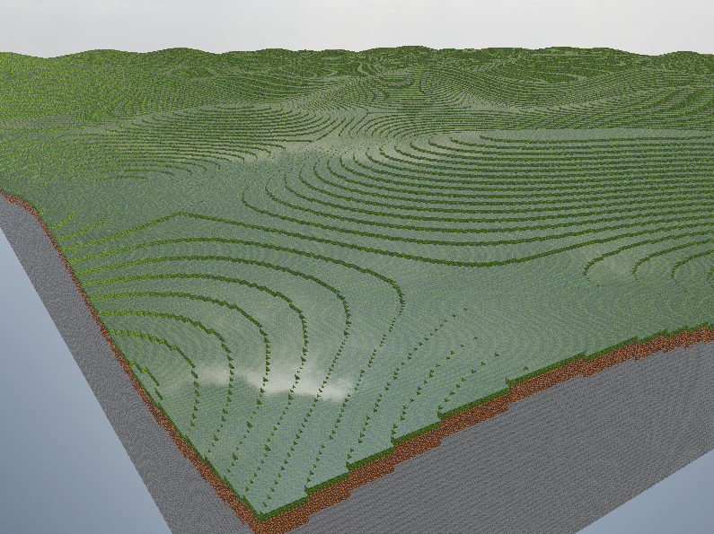

# My own voxel engine

In this project I want to create my own voxel engine using wgpu and Rust.

    

## Roadmap

**Long-term goal:** move rendering to raytracing. Everything below is prioritized with that in mind — the short-term work eliminates the CPU-side bottlenecks that would otherwise make raytracing infeasible.

### Next steps (short-term)

- [ ] Threaded chunk generation & meshing — move `World::new` work off the main thread onto a job/task queue so it no longer blocks startup/the render loop
- [ ] Chunk streaming — generate/mesh only chunks around the camera (within render distance) instead of the full 128x128 world upfront, and unload chunks that fall out of range

### Performance & architecture

- [ ] Greedy meshing to merge coplanar faces and cut draw call / vertex counts
- [ ] Batch chunk draws (indirect/instanced drawing) instead of one draw call per visible chunk

### Gameplay

- [ ] Raycast-based block placement and removal
- [ ] Player collision & physics against the voxel world (camera is currently a free-flying, non-colliding camera)
- [ ] More block/material types and a larger texture atlas
- [ ] Chunk saving/loading so edits and world state persist between runs

### Rendering

- [ ] Shadow mapping for the directional light
- [ ] Ambient occlusion on voxel face corners
- [ ] Transparent/translucent blocks (water, glass) with a separate render pass
- [ ] Level-of-detail (LOD) for distant chunks
- [ ] Raytraced rendering (long-term goal)

### Engineering

- [ ] Unit tests for chunk meshing/face-culling logic
- [ ] Benchmarks for world generation and meshing
- [ ] CI pipeline (build + test on push)
- [ ] Config file for seed, render distance, and window/graphics settings
